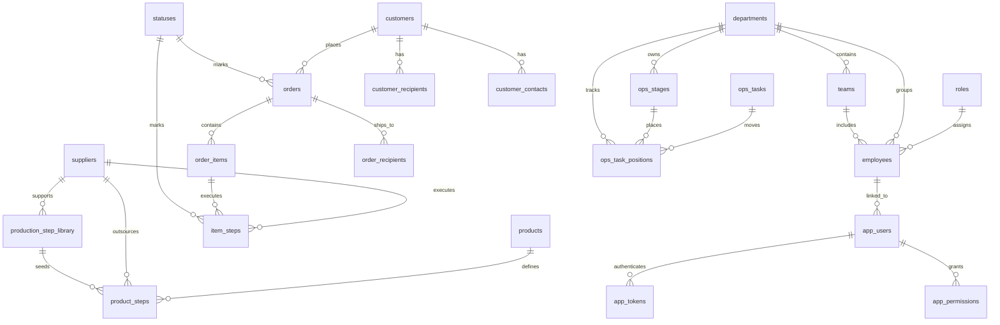

# ERD

The old plugin is a production-management system with these main domains:

- people and access
- customers and delivery
- product workflow templates
- order execution
- operations board

## High-Level ERD

## Core Tables

### People and Access

- `roles`
- `departments`
- `teams`
- `employees`
- `app_users`
- `app_tokens`
- `app_permissions`

### Customer Management

- `customers`
- `customer_recipients`
- `customer_contacts`
- `order_recipients`

### Product and Workflow

- `products`
- `production_step_library`
- `product_steps`
- `suppliers`
- `statuses`

### Order Execution

- `orders`
- `order_items`
- `item_steps`
- `notifications`

### Operations Board

- `ops_stages`
- `ops_tasks`
- `ops_task_positions`

## Rebuild Guidance

- Keep `product_steps` as templates only.
- Keep `item_steps` as execution snapshots copied from product templates at order creation time.
- Keep app auth separate from WordPress users only if the business really needs it; otherwise consider mapping to WP users later.
- Enforce route permissions per module instead of using `__return_true`.
